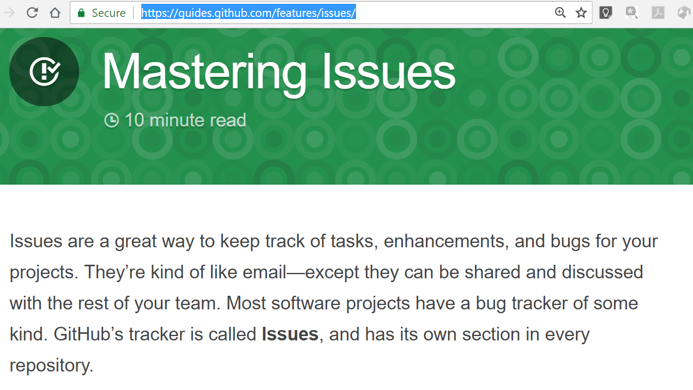
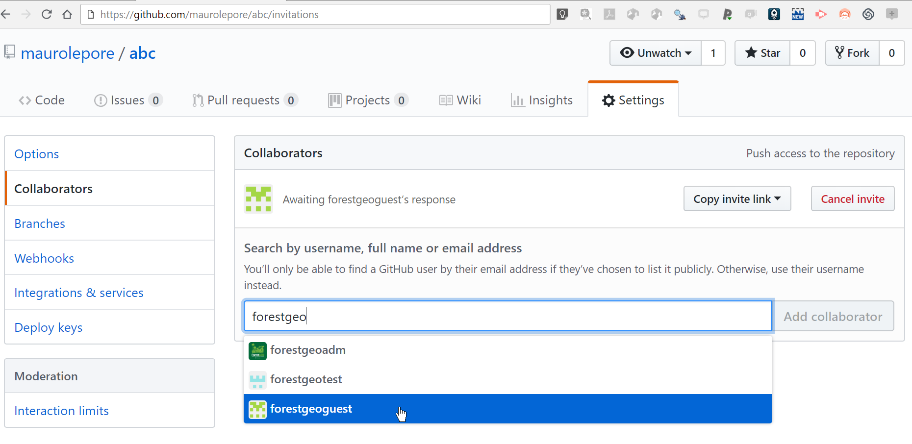

```{r setup, include=FALSE}
knitr::opts_chunk$set(
  echo = TRUE,
  collapse = TRUE
)
```

## http://bit.ly/research-with-github |
[\@mauro_lepore](https://twitter.com/mauro_lepore)

2018-08-29, 1-2:30 pm  
NMNH, Director's Conference Room - 430  
[Or join remotely](https://gist.github.com/maurolepore/554491aa1d2bc03f85bbc990b8bacd18)

## Intro

[What is github?](https://www.youtube.com/watch?v=w3jLJU7DT5E)

### About this talk

* About managing your projects online.
* NOT about code.

## Outline

* Repositories (__repos__ = super-folders = projects).
* Issues (= super emails).
* Collaborating.
* Pages.
* Organizations.
* GitHub and RStudio.

# Repositories | `https://github.com/username/repository`

* Why?
* Create a new public/private repo including README.
* Delete a repo.
* [Get unlimited private repos](https://education.github.com/discount_requests/new).

## Create a new public/private repo with a README


## Delete a repo


# Issues

* Why?
* Creating a new issue.
* Organizing issues.
* Issues templates.

## 



## 


## 


## 


## Learn more: Projects boards, Wikis | E.g. https://github.com/orgs/forestgeo/projects/1


# Collaborating

* Why?
* Who can and can't change contents and settings of a repo?
* Managing notifications at the repo- and issue-level.

## Who can edit?: Example

* maurolepore can edit https://github.com/maurolepore/abc/
* forestgeoguest can't edit yet.
* maurolepore invites forestgeoguest.
* forestgeoguest accepts .../maurolepore/abc/invitations
* forestgeoguest can edit but can't control settings.

## 



## Manage notifications: Repository level


## Manage notifications: Issue level


# Pages | `https://your-account.github.io`

* Why?
* Create a repo-specific page
* Create a user-wide page (home for all your repo-pages)

## 


## 


## 


## User-wide page | via repo `your-account.github.io/`

Example:

* Home page: https://maurolepore.github.io/
* Repo: https://github.com/maurolepore/maurolepore.github.io

Learn more:

* https://pages.github.com/
* https://help.github.com/articles/user-organization-and-project-pages/

# Organizations

* Why?
* Create an organization ([get unlimited private repos](https://education.github.com/discount_requests/new)).
* Invite people (member/owner) vs. collaborators.
* Create teams.

## 


## 


## 


## 


## 


## 


## 


## Organizaiton pages

## 


# GitHub and RStudio | Demo when it just works

* Create a new repository with a basic README.
* Clone from GitHub to my computer.
* Change README locally and push changes.
* Confirm it worked.

## Learn more:

* http://happygitwithr.com/
* [RStudio webinars 1](https://www.rstudio.com/resources/webinars/rstudio-essentials-webinar-series-managing-part-2/)
* [RStudio webinars 2](https://www.rstudio.com/resources/webinars/collaboration-and-time-travel-version-control-with-git-github-and-rstudio/)
* [Search for GitHub in my R-playlist](https://www.youtube.com/playlist?list=PLvgdJdJDL-AOJKDiV6U09LdOYOTgFpQqN)

## http://bit.ly/research-with-github |
[\@mauro_lepore](https://twitter.com/mauro_lepore)

# 

end
