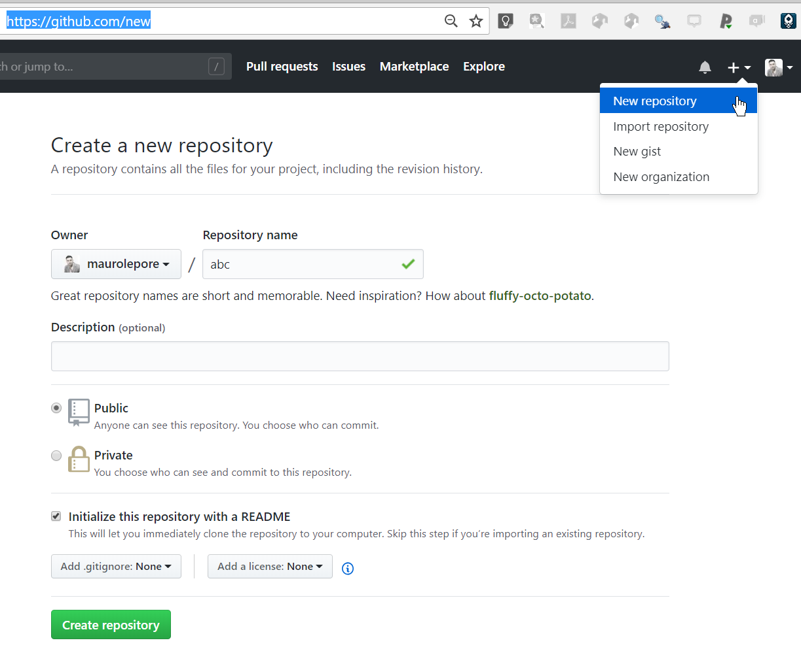
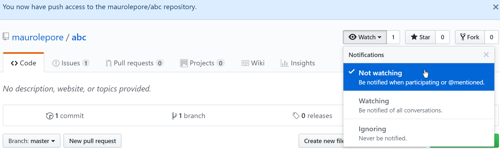
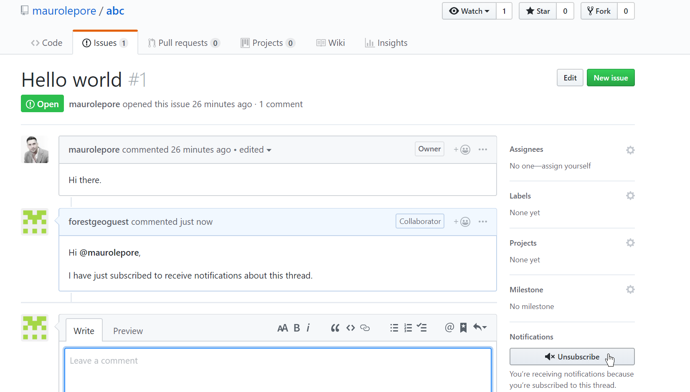
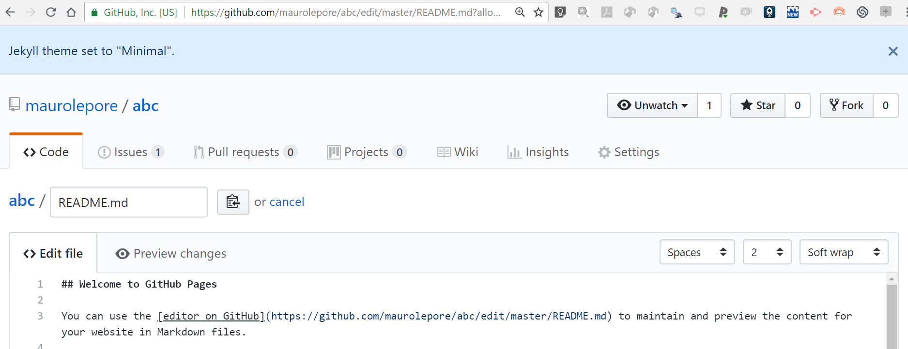
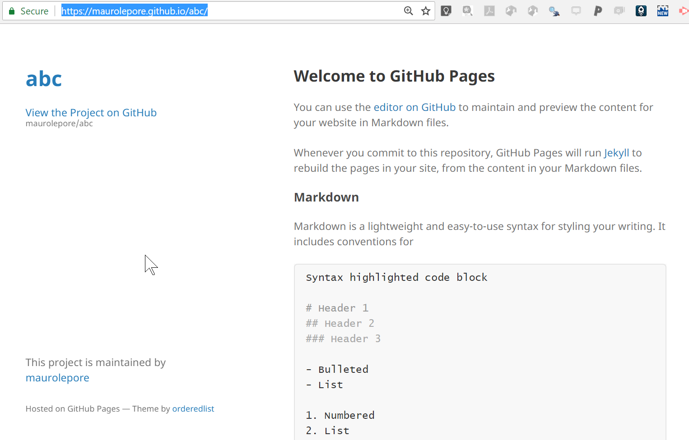
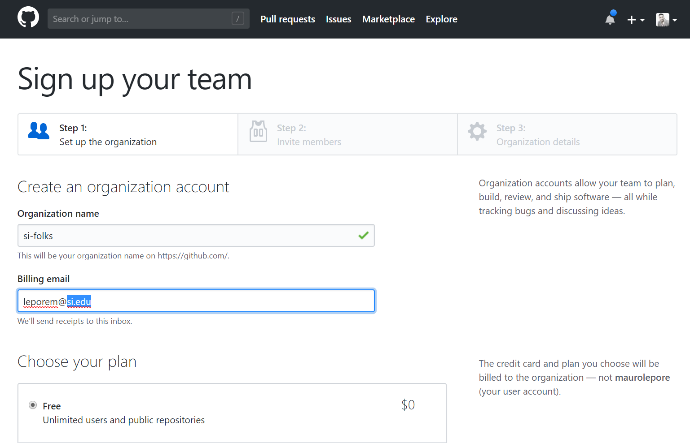
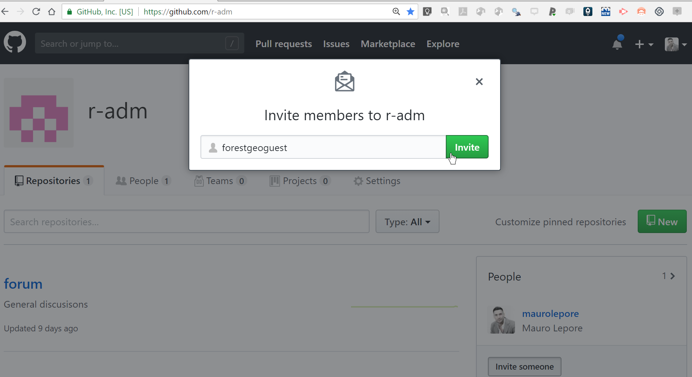
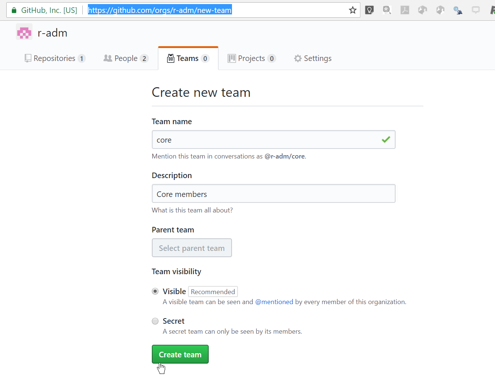
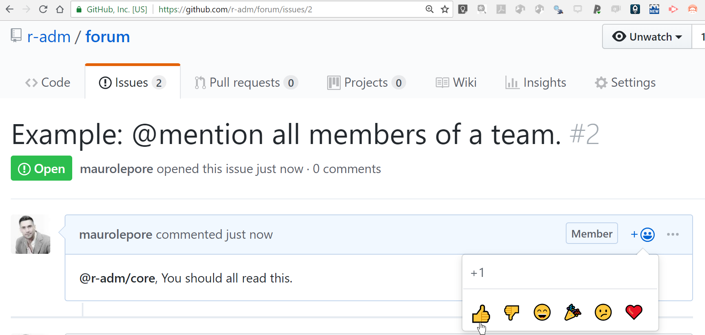

```{r setup, include=FALSE}
knitr::opts_chunk$set(
  echo = TRUE,
  collapse = TRUE
)
```

## http://bit.ly/github-to-manage-projects |
[\@mauro_lepore](https://twitter.com/mauro_lepore)


2018-08-29, 1-2:30 pm  
NMNH, Director's Conference Room - 430  
[Or join remotely](https://gist.github.com/maurolepore/554491aa1d2bc03f85bbc990b8bacd18)

[Slides](https://bookdown.org/maurolepore/github/)

[What is github?](https://www.youtube.com/watch?v=w3jLJU7DT5E)

This talk is about managing projects (not code)

## Outline (and links to videos)

* [Repositories (__repos__ = super-folders = projects).](https://youtu.be/ukQJdtGDZpk)
* [Issues (= super emails).](https://youtu.be/MOjd-11VfCU)
* [Collaborating.](https://youtu.be/A1-ZYnMAIaA)
* [Pages.](https://youtu.be/DthsJiB18fg)
* [Organizations.](https://youtu.be/YPx2bVPRIKQ)
* [GitHub and RStudio.](https://youtu.be/jc2Jo2_Zfys)

# Repositories | `https://github.com/username/repository`

* Why?
* New public/private repo with README.
* Manage privacy and delete a repo.
* [Get unlimited private repos](https://education.github.com/discount_requests/new).

## Create new repo



## Manage privacy and delete


# Issues

* Why?
* Creating a new issue.
* Organizing issues.
* Issues templates.

## Create a new issue


## Organize and find issues


## Learn more: Projects boards, Wikis | E.g. https://github.com/orgs/forestgeo/projects/1


# Collaborating

* Why?
* Who can (not) change contents/settings of a repo?
* Managing notifications at the repo- and issue-level.

## Who can edit?: Example

* maurolepore can edit https://github.com/maurolepore/abc/
* forestgeoguest can't edit yet.
* maurolepore invites forestgeoguest.
* forestgeoguest accepts at .../maurolepore/abc/invitations
* forestgeoguest can edit but can't control settings.

## Manage notifications: Repository level



## Manage notifications: Issue level



# Pages | `https://your-account.github.io`

* Why?
* Create a repo-specific page.
* Create a user-wide page.

## Create a repo-specific page


## Create a repo-specific page



## Create a repo-specific page



## Create a User-wide page | via repo `your-account.github.io/`

Example:

* https://maurolepore.github.io/
* https://github.com/maurolepore/maurolepore.github.io

Learn more:

* https://pages.github.com/
* https://help.github.com/articles/user-organization-and-project-pages/

# Organizations

* Why?
* Create an organization ([get private repos](https://education.github.com/discount_requests/new)).
* Invite people (members/owners).
* Create teams.

## Create a new organization



## Invite people



## Invite people


## Create new team



## Manage people


## Mention entire teams



## Create an organizaiton-wide page


# GitHub and RStudio | Inspiraitonal demo: When it just works

* Create a new repository with a basic README.
* Clone from GitHub to my computer.
* Change README locally and push changes.
* Confirm it worked.

## Learn more:

* http://happygitwithr.com/
* [RStudio webinars 1](https://www.rstudio.com/resources/webinars/rstudio-essentials-webinar-series-managing-part-2/)
* [RStudio webinars 2](https://www.rstudio.com/resources/webinars/collaboration-and-time-travel-version-control-with-git-github-and-rstudio/)
* [Search for GitHub in my R-playlist](https://www.youtube.com/playlist?list=PLvgdJdJDL-AOJKDiV6U09LdOYOTgFpQqN)

## http://bit.ly/github-to-manage-projects |
[\@mauro_lepore](https://twitter.com/mauro_lepore)

### Resources

* [What is github?](https://www.youtube.com/watch?v=w3jLJU7DT5E)
* [Request unlimited free private repos](https://github.com/forestgeo/learn/issues/22).
* [Mastering markdown](https://guides.github.com/features/mastering-markdown/)
* https://help.github.com/
* https://pages.github.com/
* http://happygitwithr.com/


# 

end
